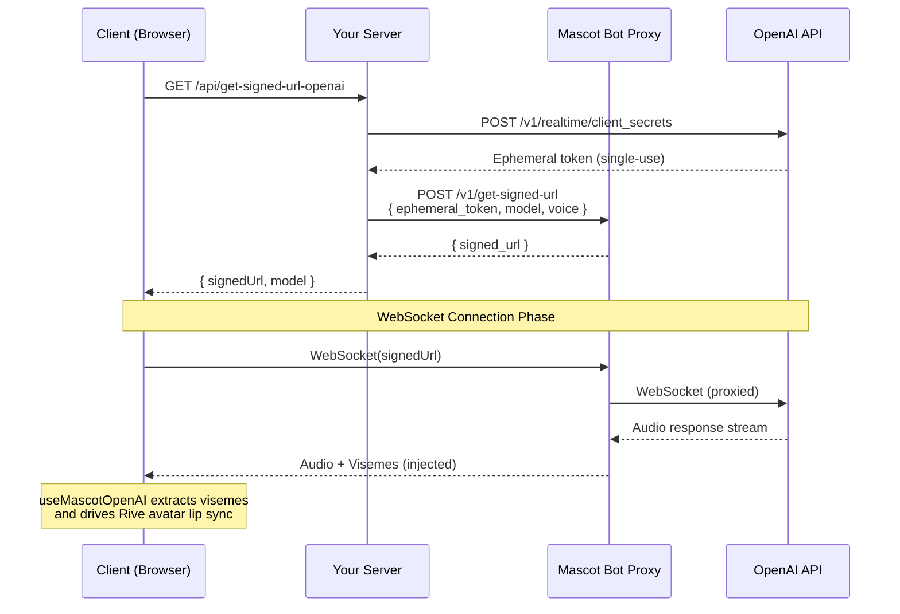

# OpenAI Realtime API Avatar — Build an Interactive Lip-Synced AI Avatar

Add a **lip-synced animated avatar** to your OpenAI Realtime API application in minutes. Mascot Bot SDK works alongside the official OpenAI Agents Realtime SDK (`@openai/agents-realtime`) — your existing OpenAI code stays untouched. Connect through a signed WebSocket URL and you get automatic viseme injection, real-time lip sync, and production-ready React components.


<Columns cols={3}>
  <Card title="Quick Start" icon="rocket" href="#quick-start">
    Add avatars in 5 minutes
  </Card>
  <Card title="Live Demo" icon="play" href="https://mascot.bot/openai-realtime">
    See OpenAI Realtime avatar in action
  </Card>
  <Card title="GitHub Repo" icon="github" href="https://github.com/mascotbot-templates/openai-realtime-avatar">
    Complete example code
  </Card>
  <Card title="Features" icon="sparkles" href="#features">
    Real-time lip sync & more
  </Card>
  <Card title="API Reference" icon="code" href="#api-reference">
    Complete hook documentation
  </Card>
  <Card title="Deploy" icon="triangle" iconType="solid" href="https://vercel.com/new/clone?repository-url=https%3A%2F%2Fgithub.com%2Fmascotbot-templates%2Fopenai-realtime-avatar">
    One-click deployment
  </Card>
</Columns>

## Why Add an Avatar to Your OpenAI Realtime API App?

The **OpenAI Realtime API** delivers native speech-to-speech conversations with ultra-low latency — but voice alone can feel impersonal. By pairing it with an **interactive AI avatar** that speaks with perfectly synchronized lip movements, you transform a voice stream into an engaging visual experience. Think of it as building a **ChatGPT avatar** that actually talks back with natural mouth animation.

Mascot Bot SDK is designed to **complement** the OpenAI Agents Realtime SDK, not replace it. You continue to use `@openai/agents-realtime` for transport, audio streaming, and event handling exactly as you normally would. Mascot Bot simply intercepts the WebSocket stream, extracts audio timing data, and drives a Rive-powered avatar with frame-accurate lip sync — all without modifying a single line of your OpenAI SDK code.

### How It Works: The Signed WebSocket URL Pattern

The integration uses a proxy pattern through signed WebSocket URLs. Your server creates an OpenAI ephemeral token, passes it to the Mascot Bot proxy, and receives a signed WebSocket URL the client connects to:

```typescript
// Without Mascot Bot — direct to OpenAI
const transport = new OpenAIRealtimeWebSocket({
  model: "gpt-realtime",
  apiKey: "your-openai-api-key",
});

// With Mascot Bot — connect through signed URL for lip sync
const transport = new OpenAIRealtimeWebSocket({
  model: config.model,
  apiKey: "proxy",
  useInsecureApiKey: true,
  createWebSocket: async () => new WebSocket(config.signedUrl) as any,
});

// Everything else stays exactly the same!
await transport.connect({ apiKey: "proxy" });
```

The Mascot Bot proxy transparently forwards all OpenAI Realtime traffic while injecting viseme data into the response stream. Your OpenAI SDK calls — `transport.sendAudio()`, event listeners, session management — all work identically.

## Features

### <Icon icon="bullseye" iconType="solid" />&nbsp; Real-time Lip Sync for OpenAI Realtime API

Frame-accurate **viseme synchronization** with OpenAI audio responses. Audio and visemes arrive in a single combined WebSocket message, ensuring zero drift between voice and mouth animation.

### <Icon icon="bolt" iconType="solid" />&nbsp; 120fps Avatar Animation

Smooth, natural **voice-driven facial animation** powered by WebGL2 and the Rive runtime. Sub-50ms audio-to-visual latency for responsive conversational AI avatars.

### <Icon icon="plug" iconType="solid" />&nbsp; Native OpenAI Agents Realtime SDK Compatibility

Works alongside `@openai/agents-realtime` with zero conflicts. Your existing OpenAI Realtime API code stays untouched — Mascot Bot integrates through a signed WebSocket URL that wraps the OpenAI connection.

### <Icon icon="shield-halved" iconType="solid" />&nbsp; Ephemeral Token Security

Full support for OpenAI's **client secrets** system. Lock system instructions, voice config, VAD settings, and model parameters server-side using the `/v1/realtime/client_secrets` endpoint. The client never sees your API key or prompt.

### <Icon icon="rotate" iconType="solid" />&nbsp; WebSocket Streaming Avatar

Automatic **WebSocket streaming avatar** data extraction from OpenAI connections. Handles all Realtime API event types including `response.audio.delta`, `response.audio.done`, and speech interruptions.

### <Icon icon="masks-theater" iconType="solid" />&nbsp; Natural Lip Sync Processing

Advanced algorithm creates natural mouth movements by intelligently merging visemes — avoiding robotic over-articulation. Configurable presets for conversation, fast speech, and clear articulation.

### <Icon icon="microphone" iconType="solid" />&nbsp; Voice Activity Detection (VAD)

Full support for OpenAI's built-in **server-side VAD**. Automatic turn detection, silence handling, and interruption management. The avatar responds naturally when you pause and stops when you interrupt — zero client-side configuration needed.

### <Icon icon="clock" iconType="solid" />&nbsp; Session Management

Built-in support for token refresh and reconnection. Pre-fetch signed URLs for instant connection, auto-refresh before expiry, and clean up on disconnect.

## Quick Start

### Installation

```bash
npm install @openai/agents-realtime wavtools ./mascotbot-sdk-react-0.1.9.tgz
# or
pnpm add @openai/agents-realtime wavtools ./mascotbot-sdk-react-0.1.9.tgz
```

<Note>
You'll receive the SDK `.tgz` file after subscribing to one of our plans. The SDK works alongside the official OpenAI Agents Realtime SDK (`@openai/agents-realtime`) without any modifications. Both packages are required for the integration.
</Note>

<Info>
**Want to see a complete working example?** Check out our [open-source demo repository](https://github.com/mascotbot-templates/openai-realtime-avatar) with full implementation, or deploy it directly to Vercel with one click.
</Info>

### Basic Integration

Here's how to add a **lip-synced avatar to the OpenAI Realtime API** in just a few lines:

```tsx
import { OpenAIRealtimeWebSocket } from '@openai/agents-realtime';
import { WavRecorder } from 'wavtools';
import {
  useMascotOpenAI,
  MascotProvider,
  MascotClient,
  MascotRive,
} from '@mascotbot-sdk/react';

function OpenAIAvatar() {
  const [session, setSession] = useState({ status: 'disconnected' });

  // Add visual avatar with one hook — it handles everything
  const { isIntercepting, messageCount } = useMascotOpenAI({
    session,
    naturalLipSync: true, // Human-like mouth movements
  });

  const startConversation = async () => {
    // 1. Get signed URL from your backend
    const res = await fetch('/api/get-signed-url-openai');
    const { signedUrl, model } = await res.json();

    // 2. Connect using OpenAI SDK — through signed URL for lip sync
    const transport = new OpenAIRealtimeWebSocket({
      model,
      apiKey: 'proxy',
      useInsecureApiKey: true,
      createWebSocket: async () => new WebSocket(signedUrl) as any,
    });

    transport.on('connection_change', (status) => {
      setSession({ status });
    });

    await transport.connect({ apiKey: 'proxy' });

    // 3. Start microphone capture (24kHz PCM16 — what OpenAI expects)
    const recorder = new WavRecorder({ sampleRate: 24000 });
    await recorder.begin();
    await recorder.record((data) => {
      if (transport.status === 'connected') {
        transport.sendAudio(data.mono as any);
      }
    });
  };

  return (
    <MascotProvider>
      <MascotClient
        src="/mascot.riv"
        inputs={['is_speaking', 'gesture']}
      >
        <MascotRive />
        <button onClick={startConversation}>Start Call</button>
      </MascotClient>
    </MascotProvider>
  );
}
```

That's it! Your **OpenAI Realtime API avatar with lip sync** is ready. The SDK handles all real-time viseme synchronization automatically.

## Complete Implementation Guide

### Step 1: Set Up Ephemeral Token Generation (Server-Side)

OpenAI Realtime API supports **client secrets** (ephemeral tokens) that lock configuration server-side. This is the recommended approach for production — the client never sees your API key, system instructions, or voice settings.

Mascot Bot fully supports this pattern. You create an OpenAI ephemeral token, pass it to the Mascot Bot proxy, and receive a signed WebSocket URL the client can safely connect to.

<Note>
The Mascot Bot proxy receives your OpenAI ephemeral token and creates a proxied WebSocket connection that injects real-time viseme data into the OpenAI Realtime stream. This is required for avatar lip sync to work.
</Note>

```typescript
// app/api/get-signed-url-openai/route.ts
import { NextResponse } from 'next/server';

// Configuration locked server-side — client never sees this
const OPENAI_CONFIG = {
  model: 'gpt-realtime',
  voice: 'marin',
  systemMessage:
    'You are a friendly assistant. Keep responses brief and conversational. Start by greeting the user when conversation starts.',
};

export async function GET() {
  try {
    const openaiApiKey = process.env.OPENAI_API_KEY;
    if (!openaiApiKey) {
      return NextResponse.json(
        { error: 'OpenAI API key not configured' },
        { status: 500 }
      );
    }

    const mascotBotApiKey = process.env.MASCOT_BOT_API_KEY;
    if (!mascotBotApiKey) {
      return NextResponse.json(
        { error: 'Mascot Bot API key not configured' },
        { status: 500 }
      );
    }

    // 1. Create OpenAI ephemeral token with locked config
    // This keeps system instructions server-side — client only gets the token
    const tokenResponse = await fetch(
      'https://api.openai.com/v1/realtime/client_secrets',
      {
        method: 'POST',
        headers: {
          Authorization: `Bearer ${openaiApiKey}`,
          'Content-Type': 'application/json',
        },
        body: JSON.stringify({
          session: {
            type: 'realtime',
            model: OPENAI_CONFIG.model,
            instructions: OPENAI_CONFIG.systemMessage,
            output_modalities: ['audio'],
            audio: {
              input: {
                turn_detection: {
                  type: 'server_vad',
                  threshold: 0.5,
                  prefix_padding_ms: 300,
                  silence_duration_ms: 500,
                },
              },
              output: {
                voice: OPENAI_CONFIG.voice,
              },
            },
          },
        }),
      }
    );

    if (!tokenResponse.ok) {
      const errorText = await tokenResponse.text();
      console.error('Failed to create ephemeral token:', errorText);
      throw new Error(`Failed to create ephemeral token: ${errorText}`);
    }

    const clientSecret = await tokenResponse.json();

    // 2. Get Mascot Bot proxy signed URL (wraps the OpenAI ephemeral token)
    const response = await fetch('https://api.mascot.bot/v1/get-signed-url', {
      method: 'POST',
      headers: {
        Authorization: `Bearer ${mascotBotApiKey}`,
        'Content-Type': 'application/json',
      },
      body: JSON.stringify({
        config: {
          provider: 'openai',
          provider_config: {
            ephemeral_token: clientSecret.value,
            model: OPENAI_CONFIG.model,
            voice: OPENAI_CONFIG.voice,
          },
        },
      }),
      cache: 'no-store',
    });

    if (!response.ok) {
      throw new Error('Failed to get signed URL');
    }

    const data = await response.json();

    // 3. Return connection info — config is NOT exposed to the client
    return NextResponse.json({
      signedUrl: data.signed_url,
      model: OPENAI_CONFIG.model,
    });
  } catch (error) {
    console.error('Error:', error);
    return NextResponse.json(
      { error: 'Failed to generate signed URL' },
      { status: 500 }
    );
  }
}

export const dynamic = 'force-dynamic';
```

<Info>
Required environment variables:
- `OPENAI_API_KEY`: Your OpenAI API key (from [platform.openai.com](https://platform.openai.com))
- `MASCOT_BOT_API_KEY`: Your Mascot Bot API key (from [app.mascot.bot](https://app.mascot.bot))
</Info>

#### Ephemeral Token Security Model

The ephemeral token flow provides a strong security boundary:



Key security properties:
- **Single-use token** — OpenAI ephemeral token expires after one connection
- **Config locked** — System instructions, voice, and VAD settings cannot be overridden by the client
- **No API key exposure** — Your OpenAI API key never reaches the browser
- **Proxy isolation** — Mascot Bot proxy adds viseme data without exposing internal routing

### Step 2: Create Your Avatar Component

Build a complete **interactive AI avatar** with conversation controls, microphone input, and session management:

```tsx
// components/OpenAIRealtimeAvatar.tsx
'use client';

import { useCallback, useEffect, useMemo, useRef, useState } from 'react';
import { OpenAIRealtimeWebSocket } from '@openai/agents-realtime';
import { WavRecorder } from 'wavtools';
import {
  MascotProvider,
  MascotClient,
  MascotRive,
  OpenAIRealtimeSession,
  useMascotOpenAI,
} from '@mascotbot-sdk/react';
import { Fit, Alignment } from '@rive-app/react-webgl2';

// Stable config — must NOT be recreated on every render
// or MascotPlayback gets destroyed and recreated, killing active lip sync
const NATURAL_LIP_SYNC_CONFIG = {
  minVisemeInterval: 40,
  mergeWindow: 60,
  keyVisemePreference: 0.6,
  preserveSilence: true,
  similarityThreshold: 0.4,
  preserveCriticalVisemes: true,
  criticalVisemeMinDuration: 80,
  desktopTransitionDuration: 18,
  mobileTransitionDuration: 22,
} as const;

interface SignedUrlConfig {
  signedUrl: string;
  model: string;
}

function OpenAIRealtimeContent() {
  const [sessionStatus, setSessionStatus] =
    useState<OpenAIRealtimeSession['status']>('disconnected');
  const [isMuted, setIsMuted] = useState(false);

  const transportRef = useRef<OpenAIRealtimeWebSocket | null>(null);
  const recorderRef = useRef<WavRecorder | null>(null);
  const configRef = useRef<SignedUrlConfig | null>(null);
  const refreshTimerRef = useRef<NodeJS.Timeout | null>(null);

  // Memoize session object to prevent unnecessary re-renders
  const session = useMemo(
    () => ({ status: sessionStatus }),
    [sessionStatus]
  );

  // Core integration hook — intercepts WebSocket and handles lip-sync + audio playback
  const { isIntercepting, messageCount } = useMascotOpenAI({
    session,
    debug: false,
    naturalLipSync: true,
    naturalLipSyncConfig: NATURAL_LIP_SYNC_CONFIG,
  });

  // Pre-fetch and periodically refresh signed URL config
  const refreshConfig = useCallback(async () => {
    try {
      const res = await fetch(`/api/get-signed-url-openai?t=${Date.now()}`, {
        cache: 'no-store',
        headers: { 'Cache-Control': 'no-cache' },
      });
      if (!res.ok) throw new Error('Failed to fetch config');
      configRef.current = await res.json();
    } catch (err) {
      console.error('[OpenAIRealtime] Config fetch failed:', err);
      configRef.current = null;
    }
  }, []);

  useEffect(() => {
    refreshConfig();
    refreshTimerRef.current = setInterval(refreshConfig, 9 * 60 * 1000);
    return () => {
      if (refreshTimerRef.current) clearInterval(refreshTimerRef.current);
    };
  }, [refreshConfig]);

  // --- Connection lifecycle ---

  const startConversation = useCallback(async () => {
    try {
      setSessionStatus('connecting');

      // Use cached config or fetch fresh
      const config = configRef.current ?? (await (async () => {
        await refreshConfig();
        return configRef.current;
      })());
      if (!config?.signedUrl) throw new Error('No signed URL');

      // Connect through signed URL — uses browser WebSocket for lip sync interception
      const transport = new OpenAIRealtimeWebSocket({
        model: config.model,
        apiKey: 'proxy',
        useInsecureApiKey: true,
        createWebSocket: async () => new WebSocket(config.signedUrl) as any,
      });
      transportRef.current = transport;

      transport.on('connection_change', (status) => {
        if (status === 'connected') {
          setSessionStatus('connected');
        } else if (status === 'disconnected') {
          setSessionStatus('disconnected');
          recorderRef.current?.end().catch(() => {});
          recorderRef.current = null;
          refreshConfig(); // Pre-fetch fresh token for next call
        }
      });

      transport.on('error', (err) =>
        console.error('[OpenAIRealtime] SDK error:', err)
      );

      // Config (instructions, voice, VAD) is locked in the ephemeral token
      // created server-side — no session.update needed from the client
      await transport.connect({ apiKey: 'proxy' });

      // Mic capture via WavRecorder (24 kHz PCM16 — what OpenAI expects)
      const recorder = new WavRecorder({ sampleRate: 24000 });
      recorderRef.current = recorder;
      await recorder.begin();
      await recorder.record((data) => {
        if (transportRef.current?.status === 'connected') {
          transportRef.current.sendAudio(data.mono as any);
        }
      });
    } catch (err) {
      console.error('[OpenAIRealtime] Failed to start:', err);
      setSessionStatus('disconnected');
      refreshConfig();
    }
  }, [refreshConfig]);

  const stopConversation = useCallback(async () => {
    transportRef.current?.close();
    transportRef.current = null;
    await recorderRef.current?.end().catch(() => {});
    recorderRef.current = null;
  }, []);

  const toggleMute = useCallback(async () => {
    const recorder = recorderRef.current;
    if (!recorder) return;

    if (isMuted) {
      await recorder.record((data) => {
        if (transportRef.current?.status === 'connected') {
          transportRef.current.sendAudio(data.mono as any);
        }
      });
    } else {
      await recorder.pause();
    }
    setIsMuted((prev) => !prev);
  }, [isMuted]);

  const isConnecting = sessionStatus === 'connecting';
  const isConnected = sessionStatus === 'connected';

  return (
    <div className="flex flex-col items-center gap-4">
      {/* Avatar display */}
      <div className="w-96 h-96">
        <MascotRive />
      </div>

      {/* Controls */}
      <div className="flex gap-2">
        <button
          onClick={isConnected ? stopConversation : startConversation}
          disabled={isConnecting}
          className="px-6 py-3 bg-green-600 text-white rounded-lg disabled:opacity-50"
        >
          {isConnecting
            ? 'Connecting...'
            : isConnected
              ? 'End Call'
              : 'Start Call'}
        </button>

        {isConnected && (
          <button
            onClick={toggleMute}
            className="px-4 py-3 bg-gray-700 text-white rounded-lg"
          >
            {isMuted ? 'Unmute' : 'Mute'}
          </button>
        )}
      </div>

      {/* Status */}
      {isIntercepting && (
        <p className="text-sm text-gray-500">
          Messages received: {messageCount}
        </p>
      )}
    </div>
  );
}

// Root component with providers
export default function OpenAIRealtimeAvatar() {
  return (
    <MascotProvider>
      <MascotClient
        src="https://your-cdn.com/mascot.riv"
        inputs={['is_speaking', 'gesture', 'character']}
        layout={{ fit: Fit.Contain, alignment: Alignment.Center }}
      >
        <OpenAIRealtimeContent />
      </MascotClient>
    </MascotProvider>
  );
}
```

### Step 3: Advanced Features

#### Token Pre-fetching for Instant Connection

Pre-fetch the signed URL before the user clicks "Start Call" to eliminate connection latency:

<Tip>
Pre-fetching reduces perceived connection time from ~1.5s to ~300ms. The signed URL is cached and refreshed every 9 minutes to stay valid.
</Tip>

```tsx
const configRef = useRef<SignedUrlConfig | null>(null);

const refreshConfig = useCallback(async () => {
  const res = await fetch(`/api/get-signed-url-openai?t=${Date.now()}`, {
    cache: 'no-store',
  });
  configRef.current = await res.json();
}, []);

useEffect(() => {
  // Fetch immediately on page load
  refreshConfig();

  // Refresh every 9 minutes (ephemeral tokens have limited lifetimes)
  const interval = setInterval(refreshConfig, 9 * 60 * 1000);
  return () => clearInterval(interval);
}, [refreshConfig]);

// In startConversation:
const config = configRef.current ?? (await fetchFresh());
```

<Warning>
OpenAI ephemeral tokens are single-use. After a call ends, the cached token is consumed. Always invalidate the cache on disconnect and fetch a fresh token for the next call.
</Warning>

```tsx
// In your connection_change handler:
transport.on('connection_change', (status) => {
  if (status === 'disconnected') {
    configRef.current = null;  // Invalidate consumed token
    refreshConfig();           // Pre-fetch fresh token for next call
  }
});
```

#### Natural Lip Sync Configuration

Create more **realistic mouth movements** by adjusting natural lip sync parameters:

<Tip>
Start with the "conversation" preset for most use cases. Adjust parameters based on your specific needs — higher `minVisemeInterval` for smoother movements, lower for more articulation.
</Tip>

```tsx
// Different presets for various use cases
const lipSyncPresets = {
  // Natural conversation — best for most OpenAI Realtime API voice AI
  conversation: {
    minVisemeInterval: 40,
    mergeWindow: 60,
    keyVisemePreference: 0.6,
    preserveSilence: true,
    similarityThreshold: 0.4,
    preserveCriticalVisemes: true,
    criticalVisemeMinDuration: 80,
    desktopTransitionDuration: 18,
    mobileTransitionDuration: 22,
  },

  // Fast speech — for excited or rapid responses
  fastSpeech: {
    minVisemeInterval: 80,
    mergeWindow: 100,
    keyVisemePreference: 0.5,
    preserveSilence: true,
    similarityThreshold: 0.3,
    preserveCriticalVisemes: true,
  },

  // Clear articulation — for educational AI tutor avatars
  educational: {
    minVisemeInterval: 40,
    mergeWindow: 50,
    keyVisemePreference: 0.9,
    preserveSilence: true,
    similarityThreshold: 0.8,
    preserveCriticalVisemes: true,
  },
};
```

<Warning>
The lip sync config object must have a **stable reference**. Define it as a `const` outside the component or wrap it in `useMemo`. Creating a new object on every render destroys and recreates the `MascotPlayback` instance, killing active lip sync.
</Warning>

```tsx
// ❌ Don't do this — creates new object on every render
useMascotOpenAI({
  session,
  naturalLipSyncConfig: {
    minVisemeInterval: 40,
    mergeWindow: 60,
  },
});

// ✅ Do this — stable reference (const outside component)
const NATURAL_LIP_SYNC_CONFIG = {
  minVisemeInterval: 40,
  mergeWindow: 60,
  keyVisemePreference: 0.6,
  preserveSilence: true,
  similarityThreshold: 0.4,
  preserveCriticalVisemes: true,
} as const;

useMascotOpenAI({
  session,
  naturalLipSyncConfig: NATURAL_LIP_SYNC_CONFIG,
});
```

#### Microphone Mute/Unmute

Control microphone input without disconnecting the OpenAI Realtime session:

```tsx
const [isMuted, setIsMuted] = useState(false);

const toggleMute = useCallback(async () => {
  const recorder = recorderRef.current;
  if (!recorder) return;

  if (isMuted) {
    // Resume recording
    await recorder.record((data) => {
      if (transportRef.current?.status === 'connected') {
        transportRef.current.sendAudio(data.mono as any);
      }
    });
  } else {
    // Pause recording — no audio sent to OpenAI
    await recorder.pause();
  }
  setIsMuted((prev) => !prev);
}, [isMuted]);
```

#### Voice Activity Detection (VAD) Configuration

OpenAI Realtime API includes built-in **server-side voice activity detection**. Configure VAD sensitivity in the ephemeral token on your server:

```typescript
// In your server-side token creation
const tokenResponse = await fetch(
  'https://api.openai.com/v1/realtime/client_secrets',
  {
    method: 'POST',
    headers: {
      Authorization: `Bearer ${openaiApiKey}`,
      'Content-Type': 'application/json',
    },
    body: JSON.stringify({
      session: {
        type: 'realtime',
        model: 'gpt-realtime',
        audio: {
          input: {
            turn_detection: {
              type: 'server_vad',
              threshold: 0.5,          // Sensitivity (0.0 = most sensitive, 1.0 = least)
              prefix_padding_ms: 300,  // Audio to include before speech detected
              silence_duration_ms: 500, // Silence before turn ends
            },
          },
        },
      },
    }),
  }
);
```

<Info>
Server-side VAD means the avatar automatically handles turn-taking — it listens while you speak and responds when you pause. Mascot Bot handles interruption events automatically, resetting the lip sync when the user interrupts the avatar mid-sentence.
</Info>

#### OpenAI Realtime API Voice Selection

OpenAI Realtime API offers multiple voices. Configure the voice in the ephemeral token:

```typescript
const OPENAI_CONFIG = {
  model: 'gpt-realtime',        // or 'gpt-realtime-mini' for lower cost
  voice: 'marin',               // OpenAI voice name
  systemMessage: 'You are a friendly assistant.',
};
```

Available voices include `alloy`, `ash`, `ballad`, `coral`, `echo`, `fable`, `marin`, `sage`, `shimmer`, and `verse`. Check OpenAI's documentation for the latest voice options.

<Tip>
Use `gpt-realtime-mini` for lower per-minute costs with slightly reduced quality. The lip sync integration works identically with both models.
</Tip>

## API Reference

### Mascot Bot Proxy API

The proxy endpoint that enables OpenAI Realtime API avatar integration:

- **Endpoint**: `POST https://api.mascot.bot/v1/get-signed-url`
- **Authorization**: Bearer token with your Mascot Bot API key
- **Provider**: `"openai"`

```json
{
  "config": {
    "provider": "openai",
    "provider_config": {
      "ephemeral_token": "openai-client-secret-here",
      "model": "gpt-realtime",
      "voice": "marin"
    }
  }
}
```

**Response:**
```json
{
  "signed_url": "wss://api.mascot.bot/v1/openai-realtime/ws?token=..."
}
```

Use `signed_url` as the WebSocket URL when initializing `OpenAIRealtimeWebSocket` via the `createWebSocket` factory.

### useMascotOpenAI Hook

The core hook for **OpenAI Realtime API avatar** integration:

<Info>
This hook automatically starts WebSocket interception when the session connects and handles all message processing internally. No manual setup required.
</Info>

```typescript
interface UseMascotOpenAIOptions {
  /** Session object with connection status */
  session: OpenAIRealtimeSession;
  /** Log WebSocket data flow (default: false) */
  debug?: boolean;
  /** Enable natural lip sync processing (default: false) */
  naturalLipSync?: boolean;
  /** Natural lip sync tuning parameters */
  naturalLipSyncConfig?: {
    /** Min time between visemes in ms (default: 40) */
    minVisemeInterval?: number;
    /** Window for merging similar visemes in ms (default: 60) */
    mergeWindow?: number;
    /** Preference for distinctive mouth shapes, 0–1 (default: 0.6) */
    keyVisemePreference?: number;
    /** Preserve silence visemes (default: true) */
    preserveSilence?: boolean;
    /** Threshold for merging similar visemes, 0–1 (default: 0.4) */
    similarityThreshold?: number;
    /** Never skip critical viseme shapes (default: true) */
    preserveCriticalVisemes?: boolean;
    /** Min duration for critical visemes in ms (default: 80) */
    criticalVisemeMinDuration?: number;
    /** Desktop transition smoothing in ms (default: 18) */
    desktopTransitionDuration?: number;
    /** Mobile transition smoothing in ms (default: 22) */
    mobileTransitionDuration?: number;
  };
}

interface UseMascotOpenAIResult {
  /** Whether WebSocket interception is active */
  isIntercepting: boolean;
  /** Number of audio+viseme messages received */
  messageCount: number;
}
```

### OpenAIRealtimeSession Interface

```typescript
interface OpenAIRealtimeSession {
  status: 'disconnected' | 'connecting' | 'connected';
}
```

The hook reacts to status changes — it starts WebSocket interception when `status` becomes `"connected"` and cleans up when `"disconnected"`.

### MascotClient Props

```typescript
interface MascotClientProps {
  /** URL to your Rive animation file */
  src: string;
  /** Artboard name in the Rive file (optional) */
  artboard?: string;
  /** Custom input names your Rive file exposes */
  inputs?: string[];
  /** Layout configuration */
  layout?: {
    fit: Fit;              // e.g., Fit.Contain
    alignment: Alignment;  // e.g., Alignment.Center
  };
}
```

## OpenAI Realtime API Pricing for Voice Avatars

OpenAI Realtime API pricing is based on token usage for both audio input and output:

| Feature | gpt-realtime | gpt-realtime-mini |
|---------|-------------|-------------------|
| Audio input | \$0.06 / 1M tokens | \$0.01 / 1M tokens |
| Audio output | \$0.24 / 1M tokens | \$0.04 / 1M tokens |
| Session limit | ~15 min per connection | ~15 min per connection |
| Latency | Lower | Similar |
| Quality | Higher | Good for most use cases |

Mascot Bot SDK adds lip sync avatar capabilities on top. Plans start at **\$149/month** with **75 hours of lip sync included**, then \~\$2.48 per additional speaking hour (\~\$0.04/min). Check [app.mascot.bot](https://app.mascot.bot) for current plans.

### All-in Cost Per Hour (OpenAI + Mascot Bot)

For budgeting, here's the combined cost of running an OpenAI Realtime API avatar:

| Component | Cost per hour | Notes |
|-----------|-------------|-------|
| **OpenAI Realtime API** (gpt-realtime) | Varies by token usage | Native speech-to-speech |
| **Mascot Bot lip sync** | \~\$2.48/hr (after 75 included hrs) | Client-side Rive animation |
| **All-in estimate** | \~\$3.83–\$4.21/hr beyond included | OpenAI API + Mascot Bot overage |

<Info>
Unlike HeyGen, D-ID, or Synthesia which charge for **server-side video rendering** (\$0.10–\$0.50/min), Mascot Bot uses **client-side Rive animation** — the lip sync cost is dramatically lower at \~\$0.04/min, and the first 75 hours per month are included in your plan.
</Info>

## MascotBot vs HeyGen vs D-ID vs Synthesia for Interactive Avatars

Looking for an **interactive avatar API**? Here's how Mascot Bot compares to popular avatar platforms:

| Feature | Mascot Bot SDK | HeyGen | D-ID | Synthesia |
|---------|---------------|--------|------|-----------|
| **Type** | Open SDK (React) | SaaS platform | SaaS platform | SaaS platform |
| **Rendering** | Client-side Rive animation | Server-side video | Server-side video | Server-side video |
| **Custom characters** | Any Rive animation | Limited templates | Stock faces | Stock presenters |
| **Real-time lip sync** | Yes (< 50ms) | Yes | Limited | Pre-rendered only |
| **OpenAI Realtime API** | Native integration | No | No | No |
| **Gemini Live API** | Native integration | No | No | No |
| **ElevenLabs** | Native integration | Partial | Yes | Yes |
| **WebSocket streaming** | Yes | Limited | No | No |
| **Code ownership** | You own the code | SaaS dependency | SaaS dependency | SaaS dependency |
| **Per-minute conversation cost** | \~\$0.04/min lip sync (75 hrs included/mo) | \~\$0.10-0.50/min | \~\$0.05-0.08/sec | Enterprise pricing |
| **Open source examples** | Yes (GitHub) | No | No | No |

<Info>
Mascot Bot is designed for developers who want **full control** over the avatar experience. Unlike SaaS platforms where you configure avatars in a dashboard, you integrate the SDK into your own React application and customize every aspect — from the character model to the voice pipeline.
</Info>

## Use Cases

### AI Customer Service Avatar
Create an engaging **conversational AI avatar** for support interactions:
- Visual feedback during voice conversations
- Natural lip sync powered by OpenAI's native speech-to-speech model
- Brand-customizable Rive characters

### ChatGPT Avatar for Your Product
Build a **ChatGPT avatar** experience for your users:
- Interactive mascot that speaks with OpenAI's voice models
- Embeddable React component for any web app
- Server-side configuration to control the personality

### Educational AI Tutor
Build an **interactive AI tutor avatar** with clear articulation:
- Visual cues help with comprehension
- Natural lip sync for educational content delivery
- GPT-powered conversation with real-time voice

### Voice AI Virtual Receptionist
Professional **voice AI avatar** for businesses:
- Welcoming visual presence on your website
- OpenAI's built-in VAD for natural turn-taking
- Ephemeral tokens for secure deployment

### AI Mascot for Streaming & Content
Build a **live avatar for streaming** and content creation:
- Animated mascot character that responds in real time
- Powered by OpenAI's speech-to-speech model
- WebGL2 rendering for smooth 120fps animation

## Troubleshooting

### Avatar Not Moving?

<Warning>
Ensure `useMascotOpenAI` is called inside a component wrapped by `MascotClient`. Check the browser console for WebSocket errors. Verify your Rive file has the correct input names (`is_speaking`, `gesture`).
</Warning>

### Only First Second of Speech Animated?

This typically happens when `naturalLipSyncConfig` is created inline, causing React to reinitialize the hook on every render:

```tsx
// ❌ Don't do this — creates new object on every render
useMascotOpenAI({
  session,
  naturalLipSyncConfig: {
    minVisemeInterval: 40,
    mergeWindow: 60,
  },
});

// ✅ Do this — define outside the component
const NATURAL_LIP_SYNC_CONFIG = {
  minVisemeInterval: 40,
  mergeWindow: 60,
  keyVisemePreference: 0.6,
  preserveSilence: true,
  similarityThreshold: 0.4,
  preserveCriticalVisemes: true,
} as const;
```

### Connection Fails on Second Call?

OpenAI ephemeral tokens are single-use. After a call ends, the cached config is consumed. Make sure you invalidate and fetch a fresh signed URL on disconnect:

```tsx
transport.on('connection_change', (status) => {
  if (status === 'disconnected') {
    configRef.current = null;   // Clear consumed token
    refreshConfig();            // Pre-fetch fresh signed URL
  }
});
```

### No Audio Playing?

The `useMascotOpenAI` hook plays audio automatically. If you don't hear audio:

1. Check that the browser's autoplay policy allows audio — user interaction (clicking "Start Call") should satisfy this
2. Check the browser console for `AudioContext` errors
3. Verify the WebSocket connection status shows `connected`

### "Invalid audio — empty bytes" Errors in Console?

This happens when the `WavRecorder` sends empty audio buffers (common in automated testing environments without a microphone). In production, this is typically not an issue. If needed, add a guard:

```tsx
await recorder.record((data) => {
  if (data.mono.length > 0 && transportRef.current?.status === 'connected') {
    transportRef.current.sendAudio(data.mono as any);
  }
});
```

### sendAudio Not Working?

The `WavRecorder` from `wavtools` produces `Int16Array` data. Pass `data.mono` directly — do **not** use `data.mono.buffer`:

```tsx
// ❌ Wrong — .buffer returns the entire backing ArrayBuffer, corrupting audio
transport.sendAudio(data.mono.buffer as ArrayBuffer);

// ✅ Correct — pass the Int16Array directly
transport.sendAudio(data.mono as any);
```

## FAQ

### How Does Mascot Bot Work with OpenAI Agents Realtime SDK?

Mascot Bot integrates through a signed WebSocket URL. Your code continues using `@openai/agents-realtime` for everything — connecting, streaming audio, handling events. The only change is pointing the transport at a Mascot Bot signed URL instead of connecting directly to OpenAI. The proxy transparently forwards all traffic while injecting viseme data for lip sync.

### Do I Need to Modify My OpenAI Realtime Code?

Minimally. If you already have a working OpenAI Realtime API application, adding Mascot Bot requires:
1. Create a server-side endpoint to generate a signed URL (wraps your ephemeral token)
2. Point `createWebSocket` to the signed URL
3. Add the `useMascotOpenAI` hook and Mascot components for the avatar

All your existing OpenAI SDK event handlers work identically.

### What is the OpenAI Realtime API Session Limit?

Each connection has a ~15-minute limit. After that, the connection closes. Your app should handle the `connection_change` event for `disconnected`, clean up resources, and allow the user to reconnect with a fresh token.

### What OpenAI Models Support the Realtime API?

The Realtime API supports `gpt-realtime` (higher quality, higher cost) and `gpt-realtime-mini` (lower cost, slightly reduced quality). Both work identically with Mascot Bot's lip sync integration. The model is specified in the ephemeral token configuration on your server.

### How Does Lip Sync Work with OpenAI Realtime API?

The Mascot Bot proxy analyzes OpenAI's `response.audio.delta` events in real time and injects viseme (mouth shape) data into the WebSocket stream. Each audio chunk contains both the original audio and timing-synchronized visemes. The `useMascotOpenAI` hook extracts this data and drives the Rive avatar's mouth animation at 120fps.

### Can I Connect Directly to OpenAI Without the Proxy?

Yes — for audio-only features, you can connect directly to OpenAI's Realtime API using `@openai/agents-realtime` as normal. However, avatar lip sync will not work without the Mascot Bot proxy, since OpenAI does not provide viseme data natively. The avatar's mouth will not move.

### What is Voice Activity Detection (VAD) in OpenAI Realtime API?

OpenAI Realtime API includes built-in server-side voice activity detection that automatically detects when the user starts and stops speaking. This enables natural turn-taking — the avatar listens while you speak and responds when you pause. Mascot Bot handles interruption events automatically, resetting the lip sync when the user interrupts the avatar.

### Is This an Open-Source Alternative to HeyGen Interactive Avatar?

Mascot Bot SDK is a developer-focused, **interactive avatar SDK** that you integrate into your own React app — unlike HeyGen's SaaS platform where you configure avatars in their dashboard. With Mascot Bot, you own the code, choose your own voice AI backend (OpenAI Realtime, Gemini Live, or ElevenLabs), and customize the character with any Rive animation. No server-side video rendering costs.

### Does Mascot Bot Support Both OpenAI and Gemini?

Yes. Mascot Bot SDK natively supports **OpenAI Realtime API**, **Gemini Live API**, and **ElevenLabs Conversational AI** as voice backends. This is a unique positioning — you can build the same avatar experience across different voice AI providers and switch between them without changing your frontend code.

### What is the Difference Between OpenAI Realtime API and Gemini Live API for Avatars?

Both are excellent choices for **interactive AI avatars**:
- **OpenAI Realtime API**: Native speech-to-speech with GPT models, built-in server VAD, WebSocket transport, lower latency for pure voice conversations
- **Gemini Live API**: Multimodal (supports webcam video input), flexible voice selection, integrated with Google ecosystem

Mascot Bot supports both — check our [Gemini Live API Avatar guide](/libraries/gemini-live-api-avatar) for the Gemini integration.

## Start Building with OpenAI Realtime API Avatar

Ready to add a **lip-synced interactive avatar** to your OpenAI Realtime API application?

<Columns cols={2}>
  <Card title="Try the Live Demo" icon="play" href="https://mascot.bot/openai-realtime">
    Experience OpenAI Realtime avatar in action
  </Card>
  <Card title="Demo Repository" icon="github" href="https://github.com/mascotbot-templates/openai-realtime-avatar">
    Complete working example
  </Card>
</Columns>

Unlike pre-rendered video avatars from HeyGen, D-ID, or Synthesia, Mascot Bot provides **real-time, interactive avatars** that respond dynamically to OpenAI's voice output. No server-side video rendering — just lightweight client-side Rive animation at a fraction of the cost, driven by the same GPT model powering your conversations.

## Next Steps

1. Get the latest SDK from [app.mascot.bot](https://app.mascot.bot) and install: `npm install @openai/agents-realtime wavtools ./mascotbot-sdk-react-[version].tgz`
2. Set up the [ephemeral token endpoint](#step-1-set-up-ephemeral-token-generation-server-side) on your backend
3. Add the `useMascotOpenAI` hook and `MascotClient` to your app
4. Choose or [customize your avatar character](/libraries/react-sdk)
5. Deploy your **OpenAI Realtime API interactive AI avatar**

Build engaging voice AI experiences with the most **developer-friendly lip sync SDK** for OpenAI Realtime API. Your users will love talking to an animated character that actually talks back.
